# 関数あみだ
# 概要
横に渡る通路が関数の箱で隠れている新感覚のあみだくじアプリ！！！

箱の中身は関数のグラフの概形をした曲線が通路となっております！ゲームをきっかけに、関数の種類やグラフの形について学びを深めていただけると嬉しいです！

数学が得意であることやグラフの概形を知っていても、必ずしも有利になるとは限りません！結果を予測できないおもしろ要素も加えております！

赤いボールが線上をたどることで答え合わせが行われます！どこに到達するかは結果確認までドキドキッ！ワクワク！グラフの曲線が描くダイナミックな動きをお楽しみください！

# 使用技術
- HTML
- CSS
- JavaScript
# 遊び方
### 1\. 「スタート」 ボタンを押す。
### 2\. プレイヤーの人数 (2~6) 及び名前 (任意) を入力する。
### 3\. 手順 2 の画面で一番上のプレイヤーから列ボタンを押すことで、あみだの列を選択する。
### 4\. 「スタート」 ボタンを押すことで結果確認を行う。横の通路を通過する際に、関数の箱がある場合、箱が外れて通路となるグラフの曲線が現れる。
### 5\. 手順 4 を人数分繰り返す。
### 6\. 「終了する」 ボタンを押すことでタイトル画面に戻る。
# コース
### 1\. ジグザグコース 
直線 ($y=x$, $y=-x$) のみの通路が出現するコースです。

### 2\. 標準コース 
出現する通路において、ジグザグコースに三角関数、指数関数、対数関数が追加されます。

### 3\. お楽しみコース 
出現する通路において、標準コースに逆三角関数、双曲線関数が追加されます。

# 関数
## 直線
- ### $y=x$
  <table>
    <tr>
      <td>関数の箱</td>
      <td>グラフの概形</td>
    </tr>
    <tr>
      <td>
        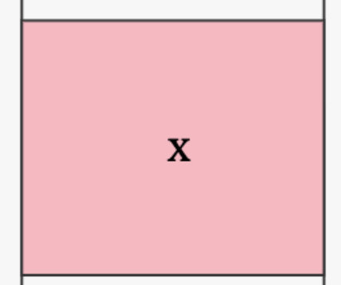
      </td>
      <td>
        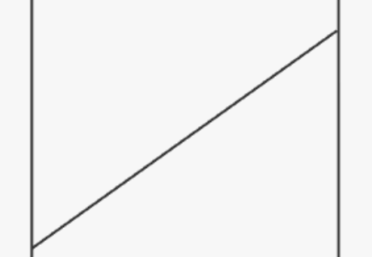
      </td>
    </tr>
  </table>
- ### $y=-x$
  <table>
    <tr>
      <td>関数の箱</td>
      <td>グラフの概形</td>
    </tr>
    <tr>
      <td>
        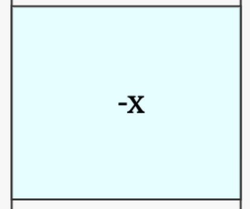
      </td>
      <td>
        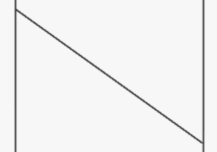
      </td>
    </tr>
  </table>

## 指数関数
下記の $e$ は自然対数の底、ネイピア数と呼ばれる数学定数で、約2.71828... と続く無理数である。
- ### $y=e^x$
  <table>
    <tr>
      <td>関数の箱</td>
      <td>グラフの概形</td>
    </tr>
    <tr>
      <td>
        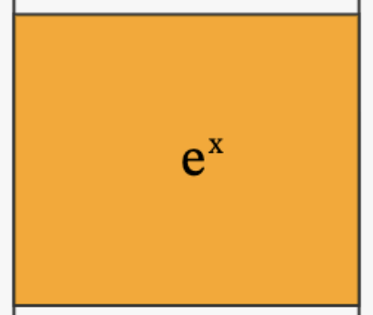
      </td>
      <td>
        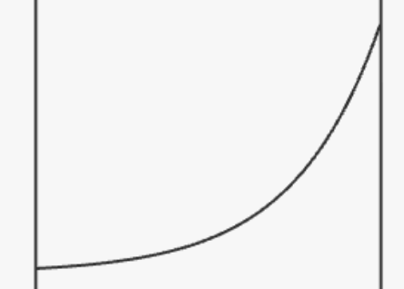
      </td>
    </tr>
  </table>
- ### $y=e^{-x}$
  <table>
    <tr>
      <td>関数の箱</td>
      <td>グラフの概形</td>
    </tr>
    <tr>
      <td>
        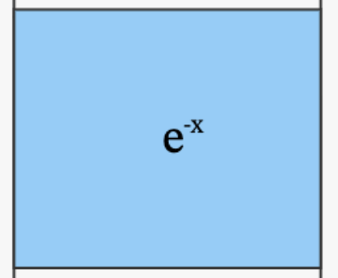
      </td>
      <td>
        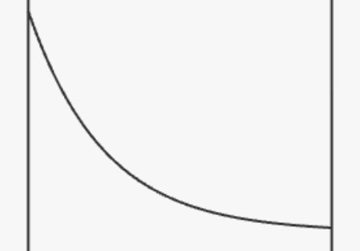
      </td>
    </tr>
  </table>

## 対数関数
- ### $y=\log x$
  - 通常 $\log_{a} x$ と表記する。 $a$ は正の定数を表し、この部分に表記する数のことを対数の底、もしくは底と呼ぶ。例えば、底が 2 の対数は $\log_{2} x$ と書く。
  - 今回の場合、底は指数関数の節で説明したネイピア数 $e$ である。この場合、底の表記を省略することができる (※) 。このように底をネイピア数とする対数のことを自然対数と呼ぶ。また $\ln x$ と表記されることもある。すなわち $\log x = \log_{e}x = \ln x$.
  - (※) 専用分野によっては底が10の対数 (常用対数と呼ぶ) $\log_{10} x$ に対して省略した表記 $\log x$ を用いることがあるので注意。

  <table>
    <tr>
      <td>関数の箱</td>
      <td>グラフの概形</td>
    </tr>
    <tr>
      <td>
        
      </td>
      <td>
        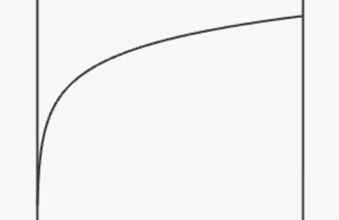
      </td>
    </tr>
  </table>

## 三角関数
- ### $y=\sin x$
  - $\sin$ と書いて「サイン」と読む。
  <table>
    <tr>
      <td>関数の箱</td>
      <td>グラフの概形</td>
    </tr>
    <tr>
      <td>
        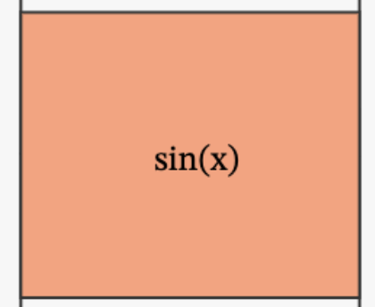
      </td>
      <td>
        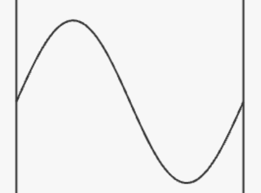
      </td>
    </tr>
  </table>
- ### $y=\cos x$
  - $\cos$ と書いて「コサイン」と読む。
  <table>
    <tr>
      <td>関数の箱</td>
      <td>グラフの概形</td>
    </tr>
    <tr>
      <td>
        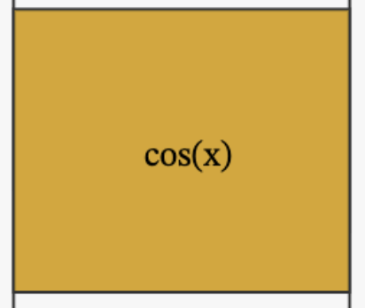
      </td>
      <td>
        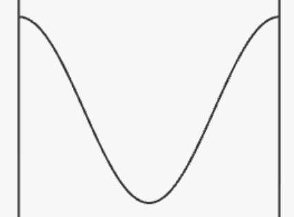
      </td>
    </tr>
  </table>
- ### $y=\tan x$
  - $\tan$ と書いて「タンジェント」と読む。
  <table>
    <tr>
      <td>関数の箱</td>
      <td>グラフの概形</td>
    </tr>
    <tr>
      <td>
        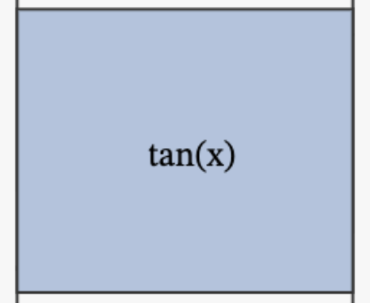
      </td>
      <td>
        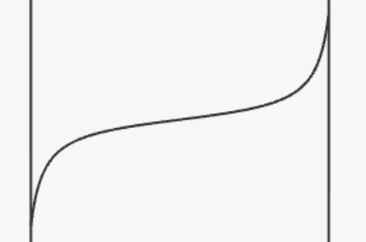
      </td>
    </tr>
  </table>

## 逆三角関数
- ### $y=\arcsin x$
  - $\arcsin$ と書いて「アークサイン」と読む。
  - $\sin x$ の逆関数である。
  - $\arcsin x$ の他に ${\rm Arcsin}\ x$, ${\rm asin}\ x$, $\sin^{-1} x$ と表記されることがある。プログラミング言語上では ${\rm asin}\ x$, 数学などの学問の専門分野では $\sin^{-1} x$ の表記がよく用いられる。
  <table>
    <tr>
      <td>関数の箱</td>
      <td>グラフの概形</td>
    </tr>
    <tr>
      <td>
        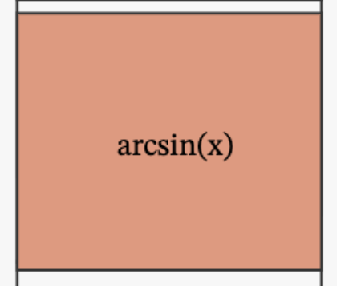
      </td>
      <td>
        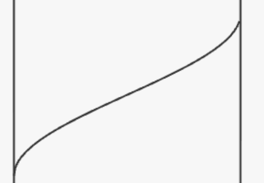
      </td>
    </tr>
  </table>
- ### $y=\arccos x$
  - $\arccos$ と書いて「アークコサイン」と読む。
  - $\cos x$ の逆関数である。
  - $\arccos x$ の他に ${\rm Arccos}\ x$, ${\rm acos}\ x$, $\cos^{-1} x$ と表記されることがある。プログラミング言語上では ${\rm acos}\ x$, 数学などの学問の専門分野では $\cos^{-1} x$ の表記がよく用いられる。
  <table>
    <tr>
      <td>関数の箱</td>
      <td>グラフの概形</td>
    </tr>
    <tr>
      <td>
        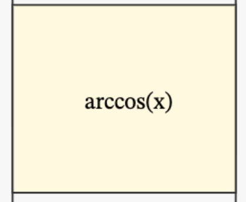
      </td>
      <td>
        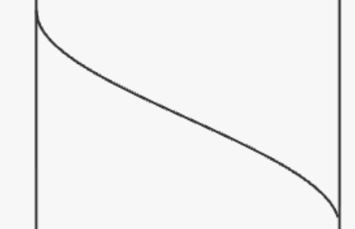
      </td>
    </tr>
  </table>
- ### $y=\arctan x$
  - $\arctan$ と書いて「アークタンジェント」と読む。
  - $\tan x$ の逆関数である。
  - $\arctan x$ の他に ${\rm Arctan}\ x$, ${\rm atan}\ x$, $\tan^{-1} x$ と表記されることがある。プログラミング言語上では ${\rm atan}\ x$, 数学などの学問の専門分野では $\tan^{-1} x$ の表記がよく用いられる。
  <table>
    <tr>
      <td>関数の箱</td>
      <td>グラフの概形</td>
    </tr>
    <tr>
      <td>
        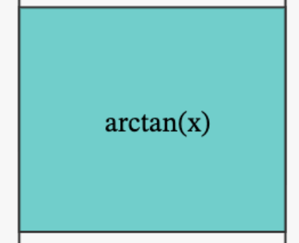
      </td>
      <td>
        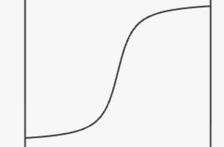
      </td>
    </tr>
  </table>

## 双曲線関数
- ### $y=\sinh x$
  - $\sinh$ と書いて「ハイパボリックサイン」と読む。
  <table>
    <tr>
      <td>関数の箱</td>
      <td>グラフの概形</td>
    </tr>
    <tr>
      <td>
        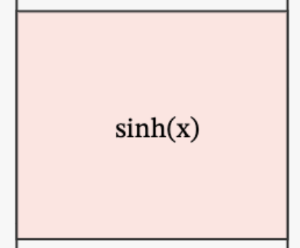
      </td>
      <td>
        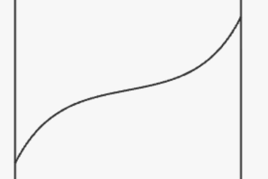
      </td>
    </tr>
  </table>
- ### $y=\cosh x$
  - $\cosh$ と書いて「ハイパボリックコサイン」と読む。
  <table>
    <tr>
      <td>関数の箱</td>
      <td>グラフの概形</td>
    </tr>
    <tr>
      <td>
        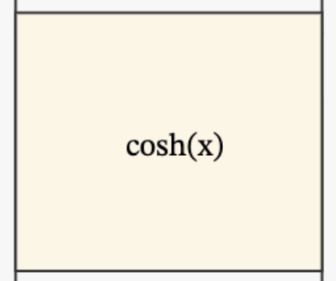
      </td>
      <td>
        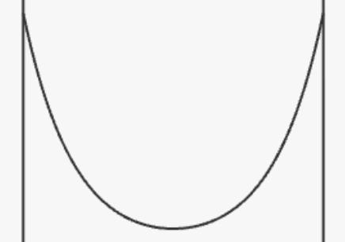
      </td>
    </tr>
  </table>
- ### $y=\tanh x$
  - $\tanh$ と書いて「ハイパボリックタンジェント」と読む。
  <table>
    <tr>
      <td>関数の箱</td>
      <td>グラフの概形</td>
    </tr>
    <tr>
      <td>
        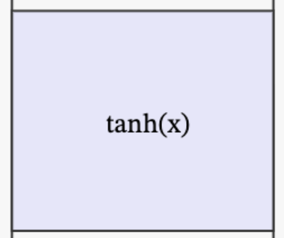
      </td>
      <td>
        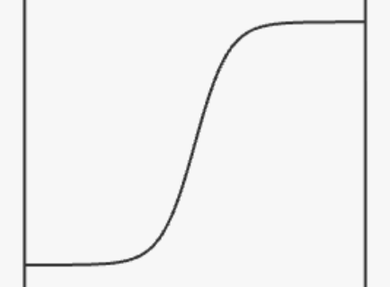
      </td>
    </tr>
  </table>
